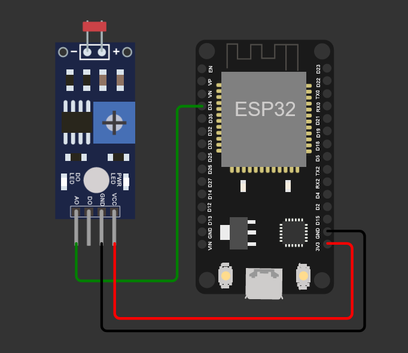

## ESP32 LED + LDR Sensor
#### Sobre

O código abaixo foi desenvolvido para ser aplicado no DOIT ESP32 DEVKIT V1 para funcionar conectado ao FIWARE Descomplicado de forma muito simples e intuitiva através do protocolo MQTT. 

#### Você deve realizar os passos a seguir utilizando a collection do Postman:

#### Health Check

1.1 Health Check: Verifica a versão do IoT Agent MQTT: API 4041

1.2 Health Check: Verifica se já existe um FIWARE Service cadastrado: API 4041

#### Criação do FIWARE Service

2: Criação do FIWARE Service (Realizar esse procedimento uma única vez): API 4041

#### Criação e registro do dispositivo

3: Provisionamento do dispositivo no IoT Agent MQTT: API 4041

4: Registro do dispositivo virtual no Orion Context Broker: API 1026

#### Operação do dispostivo:

6: Envia comandos on/off para o dispositivo: API 1026

7: Busca no Orion o valor de luminosidade enviado pelo dispositivo: API 1026

8: Busca no Orion o status do LED presente no dispositivo: API 1026

#### Deletar o dispositivo:

9: Deleta o dispositivo criado

#### Diagrama Elétrico

#### Código (IDE Arduino)

<a href="fiware_ngsi_mqtt_esp32.ino"> Código fonte para o ESP32 DEVKIT V1</a>

<a href="esp32_ntp.ino"> Código fonte para utilizar o NTP para geração de time stamp</a>

