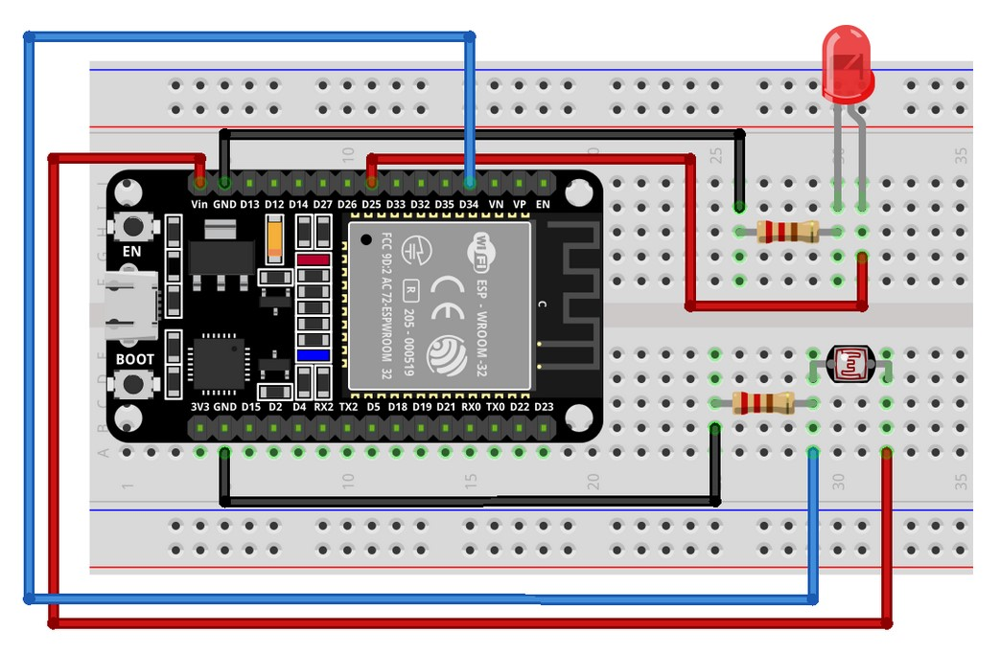

## ESP32 LED + LDR Sensor
#### Sobre

O código abaixo foi desenvolvido para o DOIT ESP32 DEVKIT V1 funcionar no FIWARE Descomplicado de forma muito simples e intuitiva através do protocolo MQTT. 

Collection do Postman: Smart Lamp

#### Realizar os métodos:

#### Health Check

1.1 Health Check: Verifica a versão do IoT Agent MQTT: API 4041

1.2 Health Check: Verifica se já existe um FIWARE Service cadastrado: API 4041

#### Criação do FIWARE Service

2: Criação do FIWARE Service (Realizar uma única vez): API 4041

#### Criação e registro do dispositivo

9: Provisionamento do dispositivo no IoT Agent MQTT: API 4041

15: Registro do dispositivo virtual no Orion Context Broker: API 1026

#### Operação do dispostivo:

16: Envia comandos on/off para o dispositivo: API 1026

17: Busca no Orion o valor de luminosidade enviado pelo dispositivo: API 1026

18: Busca no Orion o status do LED presente no dispositivo: API 1026

#### Diagrama Elétrico

#### Código (IDE Arduino)

<a href="fiware_ngsi_mqtt_esp32.ino"> Código fonte para o ESP32 DEVKIT V1</a>
<a href="esp32_ntp.ino"> Código fonte para utilizar o NTP para geração de time stamp</a>

